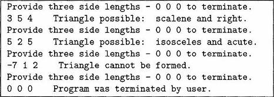

# **Nim Game**

## Background Info
---


### <u>Triangles</u>

<br>

- Triangles can be classified in a number of ways by considering the relative sizes of either their sides or their angles. Using side classifications, a triangle is *equilateral* if all sides are equal; it is *isosceles* if exactly two sides are equal; it is *scalene* if no sides are equal. Using angle classifications, a triangle is a *right* triangle if its largest angle is a right angle; it is *obtuse* if its largest angle is greater than a right angle; it is *acute* if its largest angle is less than a right angle. If the sides of a triangle are known, Pythagoras' Theorem can be used to classify the triangle as right, obtuse, or acute.

## Objective
---
<br>

- Write a program that will read an arbitrary number of sets of three integers. The program should prompt the user for sets of numbers and process them until the user submits the numbers 0 0 0. For each set of three numbers, the program should first print the values read. It should then decide whether or not the three numbers could represent the lengths of the sides of a triangle. If the numbers could not represent the lengths of sides of a triangle, an appropriate message should be printed. If they could, then the program should determine and state into which of the above classes the triangle would be placed. If the user provided input of

``` 
    3 5 4
    5 2 5
   -7 1 2
    0 0 0
```
&nbsp;&nbsp;&nbsp;&nbsp;&nbsp;&nbsp;&nbsp;&nbsp;&nbsp;&nbsp;then the program should produce output something like the following:

&nbsp;&nbsp;&nbsp;&nbsp;&nbsp;&nbsp;&nbsp;&nbsp;&nbsp;&nbsp;

---
#### Other Requirements

- Has In.java
- Used Java version 1.2 ~~(*is updated though*)~~

<br></br>

***Made on May 10th, 2023***\
***By: Aaron Prince Anu***


<sub>*Temporary?*</sub>